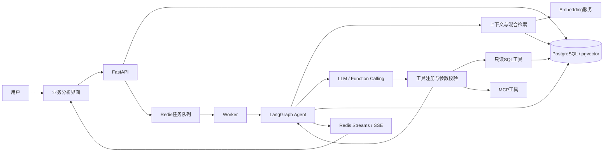

# QueryMind · 经营数据分析 Agent

QueryMind 将自然语言问题转换为可执行的只读 SQL，结合业务知识检索、工具调用和结果展示，完成销售趋势、客户贡献、商品排名与库存分析。每次分析都会保存工具记录、Prompt 与上下文快照、Token 用量及执行状态，便于追踪和评测。

**LangGraph · FastAPI · PostgreSQL / pgvector · Redis · MCP · Docker Compose**

## 核心能力

| 能力 | 实现 |
|---|---|
| 自然语言数据分析 | 通过 Function Calling 选择工具，查询 Northwind 数据，返回解释、表格和图表 |
| 语义混合检索 | `text-embedding-v4` 1024维向量 + `pg_trgm` + RRF，召回表结构、指标口径和 SQL 示例 |
| 索引与缓存管理 | 按模型、维度和知识库内容隔离索引版本；缓存命中不重复请求 Embedding |
| 可控的 Agent 执行 | SQL 错误分类、有限修复、循环与工具预算、重复调用检测、取消状态检查 |
| 只读 SQL 工具 | JSON Schema 参数校验、SQL AST 检查、独立只读账号、查询行数和语句超时限制 |
| 异步与流式交互 | 独立 Worker 执行任务，通过 Redis Streams 与 SSE 返回分析进度和回答 |
| 上下文与记忆 | 结合最近对话、知识检索和显式用户偏好构建上下文，使用 PostgreSQL Checkpoint 保存图状态 |
| 可复现评测 | 固定检索题集、参考 SQL、结果表比较、逐题报告、耗时与 Token 统计 |

## 使用场景

以 Northwind 贸易经营数据为演示数据源，包含8张业务表、3,204行数据，以及订单、客户、商品和库存分析视图。

可以直接提问：

```text
每个月的销售额趋势如何？
销售额最高的5个商品是什么？
哪些客户贡献了最多收入？
哪些商品库存低于补货点？
各物流商的平均运费和订单量分别是多少？
```

前端包含智能分析、经营看板、系统表现、数据源、指标口径和偏好设置页面，支持流式回答、图表、明细导出与多轮追问。

## 评测结果

以下为2026年9月19日的实测记录。聊天模型为 `qwen3.8-max`，向量模型为 `text-embedding-v4`。检索命中率、SQL执行成功率与最终结果正确率分别统计。

| 指标 | 结果 |
|---|---:|
| 检索 Recall@5，48题 | **47/48（97.92%）** |
| 哈希向量 + 基线融合 Recall@5，同一48题 | 17/48（35.42%） |
| 其中16道检索保留题 | **15/16（93.75%）** |
| 检索 MRR@5，48题 | 0.7285 |
| SQL严格结果表正确率，24题 | **20/24（83.33%）** |
| 首次SQL执行成功率，24题 | 24/24（100%） |
| 平均 / P95端到端耗时 | 8.02秒 / 14.55秒 |
| 自动化测试 | **78项通过** |

检索集中的32题参与过问题诊断，另16题用于本轮保留验证；这是自建小规模题集。SQL严格评分包含列名，失败项为3处列名差异和1处空结果被后续诊断查询覆盖。测试不自动评分自然语言结论，首次SQL均成功也不能证明错误恢复率。

完整记录见 [检索与SQL评测报告](docs/semantic-evaluation-result.md)，包含六组检索对照、逐题结果、失败分析和版本指纹。

## 系统架构



一次请求依次经过：创建会话与任务 → 入队 → 构建上下文 → 模型决策 → 工具执行与结果检查 → 必要时修复 → 保存并展示回答。循环次数、工具次数、Token 和时间在调用边界检查。

## 快速启动

需要 Docker Desktop，或 Docker Engine + Compose Plugin，以及可用的聊天和 Embedding 服务。联网搜索使用可选的 Tavily API Key。

### 1. 配置模型

在项目根目录中，首次使用时复制配置模板：

```bash
cp .env.example .env
```

已有 `.env` 时保留现有配置，并对照模板补齐字段。Windows 可直接复制并重命名文件。

```dotenv
LLM_API_KEY=your_chat_api_key
LLM_BASE_URL=https://dashscope.aliyuncs.com/compatible-mode/v1
LLM_MODEL=qwen3.8-max
MOCK_LLM=false

EMBEDDING_PROVIDER=openai
EMBEDDING_API_KEY=your_embedding_api_key
EMBEDDING_BASE_URL=https://dashscope.aliyuncs.com/compatible-mode/v1
EMBEDDING_MODEL=text-embedding-v4
EMBEDDING_DIMENSIONS=1024
```

聊天和向量服务分别配置，地址需要与对应密钥匹配。`EMBEDDING_PROVIDER=openai` 表示 OpenAI-compatible 接口协议，实际模型由 `EMBEDDING_MODEL` 指定。真实密钥只保存在被 Git 和 Docker 构建忽略的 `.env` 中。

常用运行参数：

| 配置 | 默认值 | 含义 |
|---|---:|---|
| `DEFAULT_TOKEN_BUDGET` | 20000 | 单次分析的Token预算 |
| `MAX_AGENT_LOOPS` | 5 | Agent最大循环次数 |
| `MAX_TOOL_CALLS` | 8 | 工具调用次数上限 |
| `MAX_SQL_REPAIRS` | 2 | SQL失败后的补救次数 |
| `MAX_RUNTIME_SECONDS` | 90 | 调用边界检查的运行时限 |
| `RAG_TOP_K` | 5 | 提供给上下文的知识条数 |
| `RAG_CACHE_SECONDS` | 300 | 检索结果缓存有效期 |

完整配置见 [.env.example](.env.example)。`MOCK_LLM=true` 只模拟聊天；离线向量测试还需显式设置 `EMBEDDING_PROVIDER=hash` 和 `EMBEDDING_DIMENSIONS=256`。真实Embedding服务失败时不会自动切换为哈希向量。

### 2. 启动服务

```bash
docker compose up -d --build
```

首次启动会初始化 PostgreSQL、Redis、Northwind 数据、业务视图、知识索引和 Checkpoint 表，然后启动 Worker、API 与 MCP 服务。相同版本的知识索引会复用；更换模型、维度或知识库内容后，重新执行启动命令构建对应版本。

### 3. 检查与访问

```bash
curl http://127.0.0.1:6006/api/v1/health
```

健康状态为 `ok` 后访问：

- 业务界面：[http://127.0.0.1:6006](http://127.0.0.1:6006)
- API文档：[http://127.0.0.1:6006/docs](http://127.0.0.1:6006/docs)
- MCP服务：`http://127.0.0.1:8010/mcp`

Windows 也可使用 `querymind.bat start`，或双击脚本打开管理菜单。

## 测试与复测

```bash
# 自动化测试：数据库和Redis需已启动；测试使用离线模型替身
docker compose exec -T api python -m pytest -q tests

# 检索对照：真实Embedding，缓存关闭
docker compose exec -T api python -m evals.run_retrieval_eval --output /app/evals/reports/retrieval-retest.json

# 端到端评测：真实聊天和Embedding模型
docker compose exec -T api python -m evals.run_eval --require-real --output /app/evals/reports/sql-retest.json

# 将新报告取回本地
docker compose cp api:/app/evals/reports/retrieval-retest.json ./evals/reports/retrieval-retest.json
docker compose cp api:/app/evals/reports/sql-retest.json ./evals/reports/sql-retest.json
```

检索评测包含哈希/语义两种向量与基线融合/修正融合/纯向量三种策略，共六组对照。SQL默认题集为 `evals/portfolio_cases.json`，使用参考SQL比对结果表；可通过 `--split heldout` 指定其保留分组。`evals/northwind_cases.json` 与 Mock 行为较为对应，仅适合回归验证。

评测报告保留失败案例、题集哈希、代码指纹、模型名称和用量。真实模型复测会产生API用量，结果会受到模型、网络和运行环境影响。

## 项目结构

```text
QueryMind/
├── app/
│   ├── main.py             # FastAPI入口
│   ├── api.py              # REST与SSE接口
│   ├── service.py          # 任务创建、执行与结果落库
│   ├── graph.py            # Agent状态与执行控制
│   ├── model.py            # Function Calling模型网关
│   ├── tools.py            # 工具注册与参数校验
│   ├── tool_errors.py      # SQL错误分类与修复建议
│   ├── context.py          # 上下文与用户偏好
│   ├── embeddings.py       # 向量接口、批量校验与用量
│   ├── rag.py              # 混合检索与版本化索引
│   ├── northwind.py        # 只读SQL、业务视图与指标
│   ├── db.py               # 数据模型
│   ├── repository.py       # 持久化读写
│   ├── runtime.py          # Checkpoint、队列与事件流
│   └── entrypoints/        # Worker与MCP进程入口
├── data/knowledge.yaml     # Schema、指标、规则与SQL示例
├── prompts/                # 版本化Prompt模板
├── scripts/bootstrap.py    # 数据库与索引初始化
├── evals/                  # 题集、评分器与实测报告
├── tests/                  # 单元与集成测试
├── static/                 # 前端页面与资源
├── docs/                   # 设计说明与评测记录
├── docker-compose.yml
├── Dockerfile
├── requirements.txt
├── querymind.bat
├── .env.example
├── LICENSE
└── README.md
```

## 运行管理

```bash
docker compose ps -a                    # 容器状态
docker compose logs -f --tail=200       # 查看日志
docker compose restart api worker      # 重启应用进程
docker compose down                    # 停止服务并保留数据卷
```

修改代码或环境变量后，使用 `docker compose up -d --build` 重新构建和创建服务。

## 实现边界

SQL执行检查不等于业务答案正确。运行时间与Token预算在调用边界检查，不能硬中断已经发出的模型请求；取消也在后续检查点生效。当前页面使用最近一次SQL结果，多查询场景的结果选择仍需完善。

当前知识库更新采用整代重建；旧索引清理、增量向量化及跨实例热切换尚未实现。系统使用内置Northwind数据，接入生产数据还需要身份认证、权限划分和租户隔离。

## 文档

- [执行控制与评测方法](docs/optimization.md)
- [语义检索与索引设计](docs/semantic-retrieval.md)
- [最新检索与SQL评测](docs/semantic-evaluation-result.md)
- [SQL阶段评测记录](docs/evaluation-result.md)

## 许可证

采用 [MIT License](LICENSE)。
